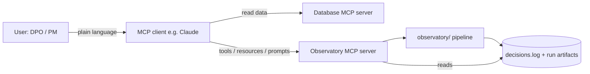

# MCP Server — Concept

> **Status:** concept only, nothing implemented. Proposed as a v1.1+ roadmap item.
> **Date:** 2026-10-09

## 1. Purpose

The Observatory pipeline today is run from Python scripts (`scripts/run_reference_audit.py`). That works for engineers but not for the people who own compliance: a DPO, a PM or a risk officer.

An **MCP (Model Context Protocol) server** adds a new "front door" to the same pipeline. Any MCP client (Claude, an IDE, a customer's own agent) can connect to it and run audits through plain-language requests. The pipeline logic does not change; the MCP layer only exposes it.

> The pipeline is the engine. MCP is a universal steering wheel any AI can grab.

## 2. How MCP works (short version)

- The **MCP server** is a small Python program (official Python SDK) that sits next to `observatory/`.
- When a client connects, the server sends a **menu** of what it offers: names, plain-language descriptions and typed inputs.
- The model reads the descriptions, picks the matching capability, fills in the inputs from the conversation and asks the user for anything missing.
- The server runs the real pipeline code and returns results; the model explains them to the user.

MCP offers three kinds of capability, chosen by **who is in control**:

| Type | Controlled by | Use in the Observatory |
|---|---|---|
| **Tools** | the model (it decides to call them) | actions: run audits, train, mitigate |
| **Resources** | the application (read-only data it pulls in) | thresholds, risk definitions, logs, past reports |
| **Prompts** | the user (picks a predefined workflow) | full compliance check, Annex IV draft |

## 3. Capability map

### Tools (wrapping existing modules)

| MCP tool | Wraps | Purpose |
|---|---|---|
| `prepare_dataset` | `ingestion.load_and_prepare` | Validate and prepare raw data; exclude protected fields before encoding |
| `train_model` | `model.train_and_evaluate` | Train the baseline and record dataset version + parameters |
| `run_disparate_impact` | `bias.disparate_impact.run_disparate_impact_battery` | DIR / SPD per protected or proxy attribute |
| `run_equalized_odds` | `bias.counterfactual_fairness.run_equalized_odds_battery` | Equalized-odds checks |
| `run_intersectional` | `bias.intersectional.run_intersectional_battery` | Two- and three-way cells with min-n rule |
| `run_mitigation` | `bias.mitigation.run_mitigation_pipeline` | ThresholdOptimizer; reports accuracy cost |
| `run_robustness` | `robustness.run_robustness_battery` | Shift, input validation, OOD, boundary sensitivity |

### Resources (read-only)

- `observatory://config/thresholds`: fairness and robustness thresholds
- `observatory://reference/eu-ai-act-risk-tiers`: risk-category definitions
- `observatory://audit/decisions-log`: `decisions.log`
- `observatory://status/modules`: `module_status.yaml`
- `observatory://runs/{run_id}`: run artifacts, e.g. `artifacts/uci_german_credit_run.json`

### Prompts (user-selected workflows)

- `full_compliance_check`: data check → training → bias batteries → robustness → summary
- `draft_annex_iv`: build Annex IV technical documentation from logs and run artifacts
- `explain_for_stakeholder`: plain-language summary of a run for non-technical readers

## 4. End-to-end user flow

Typical setup: **two MCP servers** connected to the same client.
1. The user's **database server** (existing MCP servers exist for Postgres, Supabase, etc.) to read the data.
2. The **Observatory server** for audit, training, monitoring and documentation.

| Stage | User says | What happens | EU AI Act link |
|---|---|---|---|
| 1. Data check | "Check the loan data for bias risks." | Data read via DB server → `prepare_dataset`, `run_disparate_impact` | Art. 10 data governance |
| 2. Training | "Train the model on the cleaned data." | `train_model`; dataset version + parameters logged | Art. 11 / Annex IV |
| 3. Monitoring | "How's the model doing this month?" | Monitoring runs on a **schedule, not via chat**; MCP only reads the monitoring logs (resource) and flags drift | Art. 9, Art. 12, Art. 72 |
| 4. Documentation | "Generate the technical documentation." | `draft_annex_iv` prompt pulls logs + run artifacts into a draft | Art. 11 / Annex IV, Art. 13 |

Human oversight stays in the loop: mitigation results and documentation drafts are flagged for sign-off, as in the existing `decisions.log` practice (Art. 14).

## 5. Design principles

- **Descriptions are prompts.** The model picks tools by their descriptions; vague text leads to wrong or missed calls.
- **No overlapping tools.** Each tool has one clear job.
- **Typed inputs with examples** so the model fills them in correctly.
- **State limits in descriptions**, e.g. "Audit only; not for real-time credit decisions."
- **Every MCP call is logged** to the audit trail with `source: mcp_server`.
- **Test with MCP Inspector** before connecting any client.

## 6. What gets built

| Component | Built by us? | Notes |
|---|---|---|
| Observatory MCP server | **Yes** | One Python file (~100–200 lines for v1), official MCP Python SDK; each tool is a thin wrapper around existing pipeline functions |
| Pipeline (`observatory/`) | No change | Logic stays as is |
| Database MCP server | **No** | Use an existing server (Postgres, Supabase, etc.) |

### v1 plan

1. Tool: `run_disparate_impact` (wraps `run_disparate_impact_battery`)
2. Resource: `observatory://audit/decisions-log`
3. Prompt: `full_compliance_check`
4. Test in MCP Inspector, then connect to Claude Desktop

## 7. Target stack (v2)

The v1 plan wraps the current Python scripts. On the target architecture (Airflow → Great Expectations → dbt → XGBoost/Fairlearn, PostgreSQL storage, n8n/Jira sync) the tool, resource and prompt design stays the same; only the wiring behind it changes.

| Concern | v1 (current scripts) | v2 (target stack) |
|---|---|---|
| Tools | Call Python functions directly | Trigger Airflow DAG runs via the Airflow REST API; return a run ID |
| Run status | Synchronous result | New tool `get_run_status(run_id)`; async start-then-poll pattern |
| Resources | Read files (`decisions.log`, JSON artifacts) | Query PostgreSQL tables (decision log, runs, metrics) |
| Data quality | Ingestion checks | Great Expectations validation results exposed as a resource (Art. 10 evidence) |
| Monitoring | Not implemented | Scheduled Airflow DAG (covers `art9_continuous_monitoring`); MCP only reads results |
| n8n / Jira | — | Stays outside MCP (process sync, not model-invoked) |
| Language | Python MCP SDK | Python MCP SDK (unchanged) |

Implication: long-running jobs execute in Airflow, not inside a chat request, so the server must handle async calls and cleanup correctly.

## 8. Open questions

- v1 scope: which tools first? (Suggested start: `run_disparate_impact`, decisions-log resource, `full_compliance_check` prompt.)
- Should `train_model` and `run_mitigation` require explicit human confirmation before running?
- Log format for MCP-triggered entries in `decisions.log`.
- Local-only (stdio) server first, or remote (HTTP) for demo access?
- How monitoring logs are produced (link to the `art9_continuous_monitoring` roadmap item).
